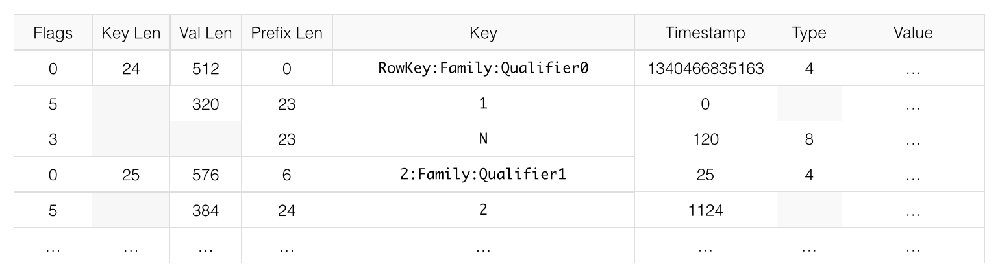

# Compression 和 Data Block Encoding


## 概述

- 编码（`Data Block Encoding`） 和 压缩（`Compression`） 的目的都通过一定的算法减少数据的大小，从而节省空间提升存储效率，时间换空间，即通过提高 CPU 的利用率来减少存储的消耗
- 编码（`Data Block Encoding`） 主要针对 Key，即 `RowKey:Family:Qualifier:Timestamp`
- 压缩（`Compression`）主要针对 Value，即 真实的数据
- 两者都是针对 `Family` 进行设置，也可同时使用
- **写路径**： Finish DataBlock –> `Encoding KVs` –> `Compress DataBlock` –> Flush
- **读路径**： Read Block From Disk –> `DeCompress DataBlock`–> Cache DataBlock –> `Decoding Scan KVs`
- 如果变更 压缩 或 编码方式，不会立即生效，会在 `compact`（合并 HFile） 阶段生效

### ❤ 如何选择

如何选择 编码 和 压缩，取决于数据特征。通常需要在 **更小的空间** 和 **更快的 编码/解压缩** 之间权衡选择，一般压缩率越高则速度更慢，反之亦然，以下建议供参考：

- 如果 Key 占用空间较大，或者有很多个 `Qualifier` ，建议开启 `FAST_DIFF` 编码
  - 如： `r00001:F:address:111111` -> `0` ，Value 就一个数字或者几个字符
- 如果 Value 很大，建议使用压缩
  - 如： `r00001:F:c:111111` -> `{name:'xx', info:{} }`  Value 是大段的文本
- 如果存储的是很少的使用的 冷数据，可使用 `gz`，相对 `snappy` 或 `lzo` 虽然需要更多的 CPU 资源，但是压缩率更高
- 如果是经常访问的数据，则可选择  `snappy` 或 `lzo`； 如果判断不了冷热特征，那就选择  `snappy` 

> 以上建议来自于 官方文档 [D.1. Which Compressor or Data Block Encoder To Use](http://hbase.apache.org/book.html#data.block.encoding.types)，**可能会略显陈旧**
>
> 可关注 `zstd` 这种压缩算法，适合小数据
>
> - zstd 官方测试数据： https://github.com/facebook/zstd#benchmarks
> - [zstd，未来可期的数据压缩算法](https://www.jianshu.com/p/71eb3071d3e0)


## 编码器

### 现有支持

```java
package org.apache.hadoop.hbase.io.encoding;

// @since 2.1.0
public enum DataBlockEncoding {

  NONE(0, null),
  
  // id 1 is reserved for the BITSET algorithm to be added later
  
  PREFIX(2, "org.apache.hadoop.hbase.io.encoding.PrefixKeyDeltaEncoder"),
  
  DIFF(3, "org.apache.hadoop.hbase.io.encoding.DiffKeyDeltaEncoder"),
  
  FAST_DIFF(4, "org.apache.hadoop.hbase.io.encoding.FastDiffDeltaEncoder"),
  
  // id 5 is reserved for the COPY_KEY algorithm for benchmarking
  // COPY_KEY(5, "org.apache.hadoop.hbase.io.encoding.CopyKeyDataBlockEncoder"),
  
  // 没了
  // PREFIX_TREE(6, "org.apache.hadoop.hbase.codec.prefixtree.PrefixTreeCodec"),
  
  ROW_INDEX_V1(7, "org.apache.hadoop.hbase.io.encoding.RowIndexCodecV1");
}
```


### 算法简介

#### PREFIX

一般来说，同一个 Block 中的 Key ( `KeyValue` 中的 `Key`，不仅包含 `RowKey`，还包含 `Family:Column` )，都很相似．它们往往只是最后的几个字符不同．例如，KeyA 是 `RowKey:Family:Qualifier0`，跟它相邻的下一个KeyB可能是 `RowKey:Family:Qualifier1`．

**如果相邻 Key 之间，完全没有共同点，那 PREFIX 显然毫无用处，还增加了额外的开销**

在 PREFIX 会额外添加一列，表示当前 Key 和 它前一个 Key 相同的前缀的长度 `PrefixLength`，如下图对比

##### 原始数据


##### 编码后的数据


#### DIFF

`DIFF` 是对 `PREFIX` 的一种改良．**它把 Key 看成多个部分，对每部分进行压缩，提高压缩率**

- `DIFF` 会导致写数据，以及 Scan 数据更慢
- 但是相对于 `PREFIX` / `NONE`，它会在 **Block Cache** 中缓存更多数据．



#### ❤ FAST_DIFF

`FAST_DIFF` 跟 `DIFF` 非常相似，**如果 Key 很长 或者 有很多Column，那么推荐使用 FAST_DIFF**

#### ~~PREFIX_TREE~~

**Trie Tree** 算法，新版好像废弃了


#### ROW_INDEX_V1

> 资料很少，从官方 Issues 找到了一些介绍资料： [A new HFileBlock structure for fast random get](https://issues.apache.org/jira/browse/HBASE-16213)
>
> - which could **improve random read (get)** performance especially **when the average record size (key-value size per row) is small**
> - Please note that if we turn this DBE on, **HFile block will be bigger than NONE encoding** because it adds some meta infos **for binary search**

从官方 Issues 的描述看出

- `ROW_INDEX_V1`  不是为了减小数据大小（**编码后占用空间更大**），而是**为了提升搜索性能**
- HBase 的原始遍历方式是线性遍历，即从 StartRow 一直到 EndRow
- `ROW_INDEX_V1`  会在 DataBlock 头部添加一些 Index 信息，使其**可进行 二分查找（binary search）**
- 提升 随机 Get 性能，对于大批数据的 Scan 操作可能并无提升效果


### 设置编码方式

```bash
# 创建
> create 'test', { NAME => 'F', DATA_BLOCK_ENCODING => 'FAST_DIFF' }

# 修改
> disable 'test';
> alter 'test', {NAME => 'F', DATA_BLOCK_ENCODING => 'ROW_INDEX_V1'}
> enable 'test';
> major_compact 'test';
```


## 压缩算法

### 支持的算法

```java
package org.apache.hadoop.hbase.io.compress;

// @since 2.1.0
public final class Compression {

  public static enum Algorithm {
    NONE("none")  { ... },

    ZSTD("zstd")  { ... },
    LZ4("lz4")  { ... },
    SNAPPY("snappy")  { ... },
    GZ("gz") { ... },
    BZIP2("bzip2")  { ... },
    LZO("lzo") { ... },
    ...
  }
  ...
}
```

### 检查本地库

```bash
# 为 true 说明可用
$ hbase --config /hbase/conf org.apache.hadoop.util.NativeLibraryChecker 
Native library checking:
hadoop:  true 
zlib:    true 
snappy:  false 
lz4:     true 
bzip2:   false 
openssl: false 
```

### 测试算法是否可用

```bash
$ hbase org.apache.hadoop.hbase.util.CompressionTest /root/gz gz.
..
2020-03-22 13:04:58,453 INFO  [main] compress.CodecPool: Got brand-new compressor [.gz]
2020-03-22 13:04:58,542 INFO  [main] compress.CodecPool: Got brand-new compressor [.gz]
2020-03-22 13:04:58,755 INFO  [main] compress.CodecPool: Got brand-new decompressor [.gz]
..


$ hbase org.apache.hadoop.hbase.util.CompressionTest /root/snappy snappy
..
Exception in thread "main" java.lang.RuntimeException: native snappy library not available: this version of libhadoop was built without snappy support.
..
```

### ❤ 压缩算法对比

|  编码器  | 场景 | 传说                                                         | 实现                                  |
| :------: | :--: | ------------------------------------------------------------ | ------------------------------------- |
| **zstd** |  热  | 压缩率比 `gz` 提高一倍<br />压缩性能与 `lz4`、`snappy` 相当甚至更好，是 `gz` 的 10倍以上 | `o.a.h.i.compress.ZStandardCodec`     |
| **lz4**  |  热  | 与 `snappy`/`lzo` 比 压缩率相差不多，但解压缩更快            | `o.a.h.i.compress.Lz4Codec`           |
|  snappy  |  热  | 压缩率没有 gz 高，但是 CPU 消耗更少                          | `o.a.h.i.compress.SnappyCodec`        |
|  **gz**  |  冷  | 相比 `snappy`、`lzo` 压缩率更高，但 CPU 消耗的也更多         | `o.a.h.i.compress.GzipCodec`          |
|  bzip2   |  冷  | 比 `gz` 压缩率高，单速度更慢                                 | `o.a.h.i.compress.BZip2Codec`         |
| ~~lzo~~  |  热  | 可使用 `snappy` 代替                                         | `com.hadoop.compression.lzo.LzoCodec` |

### 设置压缩方式

```bash
# 创建
> create 'test', { NAME => 'F', COMPRESSION => 'lz4' }

# 修改
> disable 'test';
> alter 'test', {NAME => 'F', COMPRESSION => 'gz'}
> enable 'test';
> major_compact 'test';
```

### 测试压缩性能

#### 帮助

```bash
$ hbase org.apache.hadoop.hbase.util.LoadTestTool -h
usage: hbase org.apache.hadoop.hbase.util.LoadTestTool <options>
Options:
 -v,--verbose                    显示详细日志
 -zk <arg>                       ❤ Zookeeper 地址
 -zk_root <arg>                  name of parent znode in zookeeper
 -tn <arg>                       ❤ 测试读写的表名
 -families <arg>                 列族名，多个用逗号分割
 -write <arg>                    ❤ <avg_cols_per_key>:<avg_data_size>[:<#threads=20>]
 -read <arg>                     ❤ <verify_percent>[:<#threads=20>]
 -update <arg>                   ❤ <update_percent>[:<#threads=20>][:<#whether to ignore nonce collisions=0>]
 -init_only                      ❤ 仅初始化表，不做压测
 -bloom <arg>                    布隆过滤器类型 [NONE, ROW, ROWCOL]
 -compression <arg>              ❤ 压缩算法 [LZO, GZ, NONE, SNAPPY, LZ4, BZIP2, ZSTD]
 -data_block_encoding <arg>      ❤ 编码算法 [NONE, PREFIX, DIFF, FAST_DIFF, ROW_INDEX_V1].
 -max_read_errors <arg>          允许的最大读取错误数.默认 10.
 -multiget_batchsize <arg>       是否对每一行的多列使用 multi-gets 而不是 get
 -key_window <arg>               The 'key window' to maintain between reads and writes for concurrent write/read workload. The default is 0.
 -multiput                       是否使用 multi-puts 而不是 put
 -batchupdate                    是否使用批量更新
 -in_memory                      inmemory 模式
 -generator <arg>                自定义数据生成器的类
 -writer <arg>                   执行写入的 Class
 -updater <arg>                  执行更新的 Class
 -reader <arg>                   执行读取的 Class
 -num_keys <arg>                 ❤ 读写 RowKey 的数量
 -start_key <arg>                StartKey. 默认 0.
 -skip_init                      ❤ 跳过初始化，适合测试表已经存在的情况
 -num_tables <arg>               ❤ 指定 正整数 n，测试程序将并行加载 n 个表，-tn 参数变为表名的前缀，表名变为 tn_1/tn_1/tn_../tn_n
 -encryption <arg>               传输加密，可选值 [AES]
 -deferredlogflush               Enable deferred log flush.
 -num_regions_per_server <arg>   每个 region server 的 regions 个数. 默认 5.
 -region_replication <arg>       region 的副本数
 -region_replica_id <arg>        Region replica id to do the reads from
 -mob_threshold <arg>            超过指定的字节将启用 MOB 写路径
```

#### 示例

```bash
# -write <avg_cols_per_key>:<avg_data_size>[:<#threads=20>]
# -num_keys 读写 RowKey 的数量
# -read <verify_percent>[:<#threads=20>]
# -num_tables 指定 正整数 n，测试程序将并行加载 n 个表，-tn 参数变为表名的前缀，表名变为 tn_1/tn_1/tn_../tn_n
# -data_block_encoding 编码算法 [NONE, PREFIX, DIFF, FAST_DIFF, ROW_INDEX_V1].
# -tn 测试读写的表名
$ hbase org.apache.hadoop.hbase.util.LoadTestTool \
	-write 1:10:100 \
	-num_keys 1000000 \
	-read 100:30 \
	-num_tables 1 \
	-data_block_encoding NONE \
	-tn load_test_table_name
```


## Read More

- Apache HBase ™ Reference Guide 
  - [Appendix D: Compression and Data Block Encoding In HBase](http://hbase.apache.org/book.html#compression)
- [HBase Data Block Encoding Types 介绍](https://www.jianshu.com/p/a62e49f749f3)

